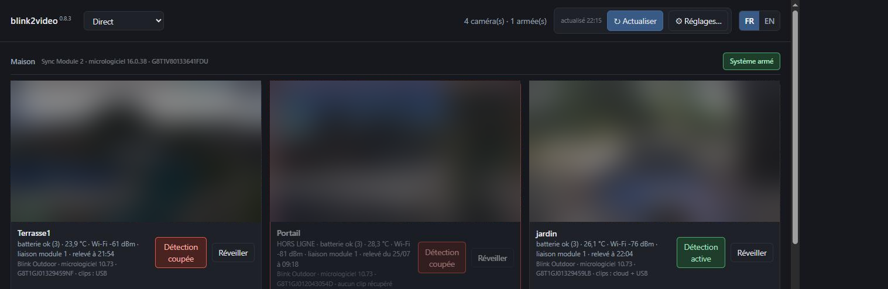
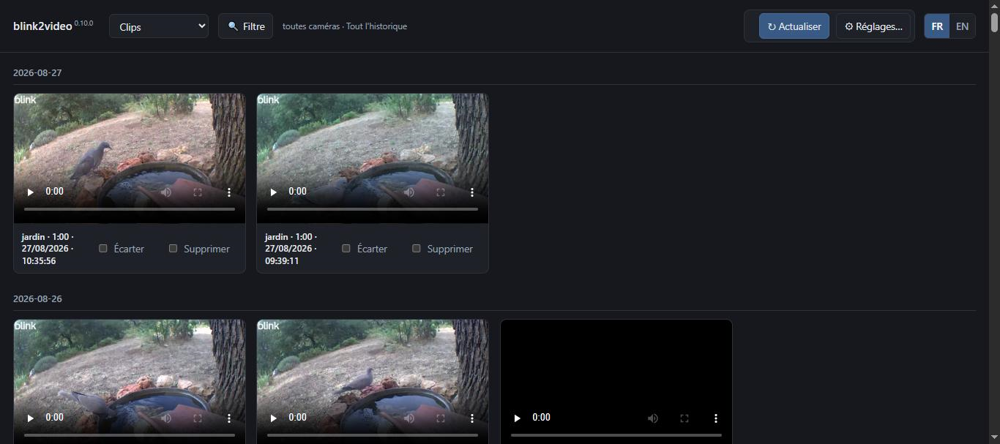
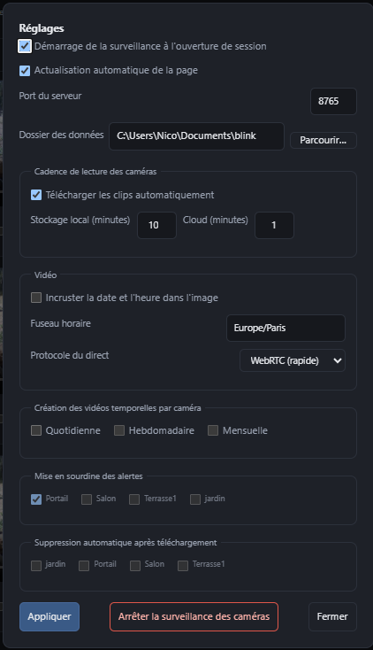

*[English](README.md) | **Français***

# blink2video

**Gérez vos caméras Blink depuis un ordinateur, et gardez ce qu'elles filment.**

Blink est pensé pour le téléphone : un clip à la fois, aucune archive, pas
d'équivalent sur ordinateur. Les enregistrements vivent sur une clé USB branchée
au module de synchronisation, effacés à mesure qu'elle se remplit, ou dans le
cloud de l'abonnement, qui les garde quelques semaines.

blink2video est le versant manquant. Une interface locale pour voir les caméras
en direct et armer la détection. Et ce que le
téléphone ne sait pas faire : récupérer les clips avant que la rotation ne les
efface, incruster l'heure dans l'image, et les assembler en une vidéo par jour,
par semaine et par mois.

Tout tourne sur votre machine. Rien n'est envoyé ailleurs.

L'interface web n'écoute que sur `127.0.0.1` : rien d'autre sur votre réseau
local ne peut l'atteindre, seulement cette machine. Elle n'a pas de mot de
passe propre au-delà de la session du compte Blink : quiconque a accès à
cette machine peut donc l'ouvrir.

## Fonctionnalités

- Visionnage du direct de n'importe quelle caméra dans le navigateur, armement
  du système ou d'une seule caméra.
- Téléchargement incrémental des clips de détection de mouvement depuis la clé
  USB du module et depuis le cloud de l'abonnement, sans jamais rapatrier deux
  fois le même enregistrement.
- Affichage de l'état des caméras : batterie, température, signal, modèle et
  micrologiciel de chaque caméra.
- Incrustation de la date et heure dans l'image, donc conservée par n'importe
  quel lecteur.
- Création d'une vidéo par jour, par semaine ISO et par mois, pour chaque
  caméra.
- Possibilité d'écarter les clips sans intérêt d'un clic, mis de côté plutôt
  que supprimés, et jamais retéléchargés.
- Surveillance continue et alerte : caméra hors ligne, batterie faible,
  détection coupée, ou rien d'enregistré depuis deux jours. Alerte à acquitter,
  sourdine par caméra.
- Logiciel autonome pour Windows, Linux et macOS, ffmpeg inclus.

## Captures d'écran



Le Direct : une tuile par caméra, sa dernière vignette, l'armement du système et
de chaque caméra, la batterie, la température, le signal et la date du relevé.
Une caméra hors ligne continue d'annoncer ses dernières valeurs connues, et
l'interface dit de quand elles datent.



Les clips du plus récent au plus ancien, filtrables par caméra et par jour.
Chaque carte donne la caméra, la durée, la date et le modèle, et le bouton
« Écarter » retire le clip de toutes les vidéos assemblées.



Les réglages, derrière l'icône engrenage : démarrage automatique à
l'ouverture de session, actualisation automatique de la page, port du
serveur, dossier des données avec un sélecteur natif, et cadence de lecture
des caméras USB et cloud. Aussi l'horodatage incrusté dans l'image, le
fuseau horaire, l'archivage quotidien/hebdomadaire/mensuel activable
indépendamment, la mise en sourdine des alertes par caméra, et un bouton
pour arrêter toute la surveillance sans passer par le mode CLI.

## Démarrer

**1. Installer.** Téléchargez l'archive de votre système depuis la
[dernière version publiée](https://github.com/nico579/blink2video/releases/latest)
et décompressez-la. ffmpeg voyage dans le bundle, rien n'est installé dans le
système.

| Système | Archive | Premier lancement |
|---|---|---|
| Windows 10/11, x86-64 | `blink2video-windows-x86_64.zip` | `blink2video.exe` depuis un terminal |
| Linux x86-64, glibc 2.35+ (Ubuntu 22.04+, Debian 12+) | `blink2video-linux-x86_64.tar.gz` | `chmod +x blink2video`, puis `./blink2video` |
| macOS 12+, Apple Silicon | `blink2video-macos-arm64.zip` | `xattr -dr com.apple.quarantine blink2video`, puis `./blink2video` |

**2. Le lancer.** Double-clic sur l'exécutable (ou `./blink2video` depuis un
terminal). Aucun argument nécessaire : sans session valide, un onglet s'ouvre
tout seul sur une page de connexion — votre adresse, votre mot de passe, puis
le code que Blink envoie. Seul un jeton de session est conservé, jamais le mot
de passe.
Une fois connecté, tout démarre seul : la surveillance, le rapatriement des
clips et l'assemblage des vidéos, chacun à son rythme, et les clips
apparaissent dans l'onglet Clips au fur et à mesure.

Si l'onglet ne s'est pas ouvert, ou que vous l'avez fermé, `blink2video open`
le rouvre.

Une icône apparaît aussi dans la zone de notification quand `start` tourne
(Windows/macOS ; sous Linux, selon la prise en charge de votre bureau), avec
Ouvrir/Redémarrer/Arrêter, sans passer par le terminal.

**3. Réglages.** L'icône engrenage, en haut à droite, ouvre un panneau :
démarrer automatiquement à l'ouverture de session, actualiser la page toute
seule à l'arrivée des clips, la fréquence de lecture des caméras USB et cloud,
et un bouton pour tout arrêter. `blink2video autostart on` et `blink2video stop`
font la même chose depuis un terminal, si vous préférez.

<details>
<summary>Depuis les sources, avec Python 3.11 ou plus récent</summary>

```bash
git clone https://github.com/nico579/blink2video
cd blink2video
python blink2video.py login
```

Le premier lancement crée un environnement isolé dans `~/.blink2video/venv` et
s'y relance. `blink2video smoketest` vérifie ensuite que tout fonctionne sur
votre machine.

Le binaire publié n'est ni signé ni notarisé : sous macOS, Gatekeeper refuse le
premier lancement d'une archive téléchargée par un navigateur, d'où le `xattr`
du tableau. Un clic droit puis « Ouvrir » fait la même chose.

</details>

<details>
<summary>Avec Docker</summary>

```bash
git clone https://github.com/nico579/blink2video
cd blink2video
docker compose up -d
```

Ouvrez `http://127.0.0.1:8765` et connectez-vous de la même façon. Réglages,
session et clips persistent dans un volume nommé (`blink_data`), séparé de
l'image : reconstruire l'image ne perd jamais rien.

Le `docker-compose.yml` fourni publie le port sur `127.0.0.1` uniquement,
comme le binaire par défaut : il n'y a aucune connexion sur le tableau de bord
lui-même, donc rien au-delà de cette machine ne peut l'atteindre sauf à élargir
volontairement la publication du port.

</details>

## L'interface

La page, sur `127.0.0.1:8765`, a cinq vues :

- **Direct** : une tuile par caméra, son état, l'armement de la détection, un
  bouton plein écran, et un bouton « Réveiller » qui demande une photo
  fraîche à la caméra tout de suite plutôt que d'attendre son prochain
  passage prévu (consomme un peu de batterie, jusqu'à deux minutes sur une
  caméra endormie).
- **Clips** : du plus récent au plus ancien, avec un aperçu et un bouton
  « Écarter » qui retire un clip de toutes les vidéos assemblées.
- **Journalières, Hebdomadaires, Mensuelles** : les vidéos assemblées.

Le bouton Actualiser rapatrie les nouveaux clips et reconstruit les vidéos, en
affichant l'avancement.

## Être prévenu

Une caméra hors ligne, une batterie qui faiblit, une détection coupée ou une
caméra muette depuis deux jours ouvrent une fenêtre à acquitter. Les alertes ne
se déclenchent que sur un changement : une caméra que vous laissez sciemment
hors ligne ne prévient qu'une fois.

## Mettre à jour

Quand une version plus récente est publiée, l'interface affiche un bouton
**Installer 0.x.y**. Il s'occupe de tout : téléchargement, arrêt, remplacement,
relance des mêmes verbes. Rien n'est remplacé tant que la nouvelle version n'a
pas démarré et annoncé son numéro, et les fichiers précédents sont gardés de
côté jusqu'à ce que la permutation aboutisse.

## Où vont les fichiers

```
Blink_Clips/       clips bruts, tels que le module les a enregistrés
Blink_Normalized/  les mêmes avec l'heure incrustée
Blink_Excluded/    les clips écartés, conservés plutôt que supprimés
Blink_Daily/       une vidéo par caméra et par jour
Blink_Weekly/      une par semaine ISO
Blink_Monthly/     une par mois
```

À côté de l'exécutable, ou dans le dossier désigné par `BLINK_HOME`.

<details>
<summary>Comment ça marche</summary>

Le clip normalisé est le pivot. Chaque clip est ré-encodé une fois, l'heure
inscrite dans l'image, puis conservé définitivement. Les vidéos journalières,
hebdomadaires et mensuelles ne sont que des copies de flux de ces segments :
aucun ré-encodage, aucune perte de génération, quelques secondes chacune.

C'est ce qui rend l'ajout d'un clip peu coûteux. Un nouvel arrivant ne ré-encode
que lui-même, à peu près au temps réel : un clip d'une minute coûte une minute,
une seule fois.

L'heure est incrustée dans l'image plutôt qu'ajoutée en piste de sous-titres,
que les téléphones et les messageries ignorent. La conversion de fuseau est
faite côté Python, ffmpeg tournant avec `TZ=UTC0` : la chaîne ne dépend d'aucune
base de fuseaux du système.

Un clip est identifié par sa caméra et son instant d'enregistrement, jamais par
l'identifiant du module : redémarrer celui-ci renumérote tout, et les clips déjà
récupérés reviendraient comme neufs.

</details>

## Limites

- Une caméra hors de portée du module accepte la demande de direct mais n'envoie
  jamais d'image ; l'interface le dit.
- Sous Linux, le ffmpeg d'imageio-ffmpeg est compilé sans libfreetype et ne sait
  pas incruster l'horodatage : `sudo apt install ffmpeg`. L'outil essaie chaque
  ffmpeg trouvé et retient le premier capable d'écrire du texte. Windows et
  macOS n'ont besoin de rien.
- Les notifications empruntent les outils du système : fenêtre native sous
  Windows, osascript sous macOS, notify-send et zenity sous Linux. À défaut, la
  surveillance écrit dans `watch.log` et continue. Sous Windows, l'outil déclare
  son identité de notification au premier envoi, dans
  `HKCU\SOFTWARE\Classes\AppUserModelId\blink2video` : sans elle, le système
  jette les notifications sans rien dire. Supprimer cette clé annule la
  déclaration.
- Rien ne tourne pendant que l'ordinateur est éteint : une caméra qui tombe la
  nuit est signalée à l'ouverture de session suivante.
- Blink refuse certains points d'entrée de son API selon la version de client
  annoncée, avec un « An app update is required ». Le direct et le
  téléchargement fonctionnent aujourd'hui ; rien ne garantit que Blink
  n'étende pas ce refus.
- Blink n'expose aucun moyen de redémarrer un module bloqué : il faut le
  débrancher.

## Voisins

D'autres projets touchent au même matériel, et se complètent plus qu'ils ne se
concurrencent :

- [blinkpy](https://github.com/fronzbot/blinkpy) est la bibliothèque d'accès à
  l'API sur laquelle repose tout le reste, celui-ci compris.
- [BlinkCamWindowsDashboard](https://github.com/mikeoverbay/BlinkCamWindowsDashboard)
  offre un tableau de bord web et le téléchargement des clips, depuis le cloud
  uniquement, donc avec un abonnement obligatoire, et sans direct.
- [blinkbridge](https://github.com/roger-/blinkbridge) expose une caméra en RTSP,
  pour l'intégrer à un système de vidéosurveillance existant.
- [blink-live-view](https://github.com/andreiele/blink-live-view) se consacre au
  direct sur le bureau.

blink2video se distingue sur trois points : il lit **les deux** sources, la clé
USB du module et le cloud de l'abonnement, sans jamais rapatrier deux fois le
même enregistrement ; il incruste l'heure dans l'image et assemble une vidéo par
jour, par semaine et par mois ; et il tourne sur les trois systèmes en bundle
autonome, ffmpeg compris.

## Ligne de commande

Tout ce qui précède fonctionne déjà depuis la page web. Ce chapitre couvre
l'alternative terminal : scripter, une machine sans écran, une composition sur
mesure, ou la liste complète des options.

<details>
<summary>Toutes les options</summary>

<!-- verbes:début -->
Une commande, un verbe par action. `blink2video <verbe> --help` donne les options de chacun.

```bash
blink2video login       # se connecter au compte Blink, vérification en deux étapes gérée
blink2video list        # ce que contient le module de synchronisation en ce moment
blink2video download    # récupérer les nouveaux clips avant que la rotation ne les efface
blink2video merge       # normaliser, horodater et assembler jour, semaine et mois
blink2video watch       # contrôler l'état de l'installation et alerter s'il se dégrade
blink2video serve       # servir l'interface web, pour regarder, écarter, voir en direct
blink2video start       # tout lancer avec les réglages recommandés
blink2video open        # ouvrir l'interface web dans le navigateur
blink2video stop        # arrêter l'instance qui tourne en fond
blink2video restart     # arrêter puis relancer avec les réglages actuels
blink2video update      # installer la dernière version publiée
blink2video autostart   # inscrire à l'ouverture de session la commande qui suit
blink2video smoketest   # vérifier que l'installation fonctionne sur cette machine
```
<!-- verbes:fin -->

Les options suivent le verbe : `blink2video serve --port 8899`. Plusieurs verbes
se citent d'affilée, chacun avec les siennes. Ce qui se termine s'enchaîne dans
l'ordre cité, ce qui ne se termine pas tourne à côté : `blink2video download merge`
télécharge **puis** assemble, tandis que `serve`, ou tout verbe muni de `--loop`,
occupe son propre processus jusqu'à `blink2video stop`.

`blink2video <verbe> --help` fait toujours foi ; ce tableau récapitule.

**Racine** : `login`, `list`, `download`. Sans verbe, l'aide s'affiche.

| Option | Effet |
|---|---|
| `--hub NOM` | module de synchronisation à utiliser |
| `--camera NOM` | ne garder que cette caméra |
| `--since JOURS` | ne garder que les clips des N derniers jours |
| `--output DOSSIER` | destination des clips bruts (défaut `Blink_Clips`) |
| `--overwrite` | remplacer les fichiers existants de taille différente |
| `--from usb\|cloud\|all` | où chercher les clips : la clé du module, le cloud de l'abonnement, ou les deux (défaut) |
| `--loop [MINUTES]` | répéter au lieu d'agir une fois (défaut 10) |

**`blink2video merge`** : normalisation et assemblage.

| Option | Effet |
|---|---|
| `--exclude CLIP…` | écarter des clips : le brut part dans `Blink_Excluded`, le segment est effacé, le clip n'est plus retéléchargé |
| `--include CLIP…` | annuler une exclusion : le brut revient et le clip est re-normalisé |
| `--date AAAA-MM-JJ` | limiter à une journée |
| `--camera NOM` | limiter à une caméra |
| `--force` | tout reconstruire même si rien n'a changé |
| `--no-weekly` | ne pas reconstruire les agrégats hebdomadaires |
| `--no-monthly` | ne pas reconstruire les agrégats mensuels |
| `--no-timestamp` | ne pas incruster la date et l'heure dans l'image |
| `--preset NOM` | preset libx264, d'`ultrafast` à `veryslow` (défaut `veryfast`) |
| `--crf N` | qualité, 0 à 51, plus bas est meilleur (défaut 21) |
| `--font FICHIER` | police .ttf pour l'horodatage |
| `--timezone ZONE` | fuseau de l'horodatage (défaut `Europe/Paris`) |
| `--input`, `--output`, `--normalized-output`, `--excluded-output`, `--weekly-output`, `--monthly-output` | emplacements de chaque dossier |

**`blink2video watch`** : contrôler l'état, alerter s'il se dégrade. `--ignore
CAMERA…` met une caméra en sourdine, puis poursuit le contrôle ;
`--unignore CAMERA…` lève la sourdine.

| Option | Effet |
|---|---|
| `--loop [MINUTES]` | répéter au lieu d'agir une fois (défaut 10) |
| `--ignore CAMERA…` | mettre une caméra en sourdine, puis poursuivre le contrôle |
| `--unignore CAMERA…` | lever la sourdine |
| `--test` | déclencher une notification de vérification |
| `--dry-run` | montrer sans notifier ni enregistrer l'état |

**`blink2video start`** : la configuration recommandée, en une commande. Elle
équivaut exactement à :

```bash
blink2video serve  watch --loop 10  download --from usb --loop 10  download --from cloud --loop 1  merge --loop 5
```

Les options données après `start` vont à l'interface, `--port` par exemple.

**`blink2video serve`** : servir l'interface web.

| Option | Effet |
|---|---|
| `--port N` | port d'écoute (défaut 8765) |
| `--open-browser` | ouvrir la page dans le navigateur au démarrage |
| `--hub NOM` | module de synchronisation |
| `--thumbs DOSSIER` | cache des vignettes, jetable |
| `--timezone ZONE` | fuseau d'affichage |
| les mêmes options de dossiers que `merge` | |

**`blink2video open`** : ouvrir l'interface dans le navigateur, et dire si
personne n'écoute. `--port` si vous l'avez déplacée.

**`blink2video stop`** : arrêter l'instance en cours et tous ses verbes. Sans option.

**`blink2video autostart`** : ce qui se lancera à l'ouverture de session.

| Commande | Effet |
|---|---|
| `autostart on` | inscrire `blink2video start` |
| `autostart on <verbes…>` | inscrire cette commande-là plutôt que le défaut |
| `autostart status` | ce qui est inscrit, et ce qui tourne |
| `autostart off` | retirer l'entrée |

`--dry-run` montre sans rien modifier.

**`blink2video smoketest`** : contrôle de l'installation. `--keep` conserve le dossier
de travail, `--timezone` choisit le fuseau de la vidéo de démonstration.

**Variables d'environnement**

| Variable | Effet |
|---|---|
| `BLINK_HOME` | dossier des données, à défaut celui de l'exécutable |
| `BLINK_BOOTSTRAP` | `auto`, `pip` ou `none` : gestion de l'environnement Python |

</details>

**Premier lancement**, étape par étape plutôt qu'un double-clic :

```bash
blink2video login       # se connecter, une fois
blink2video list         # verifier que ca repond : clips presents sur le module
blink2video start         # meme composition que ce que lance le double-clic
```

**Grammaire.** Trois règles suffisent. Le verbe d'abord, ses options ensuite.
Plusieurs verbes se citent à la suite, chacun avec les siennes. Ce qui boucle
tourne à côté, le reste s'enchaîne dans l'ordre où c'est écrit. Une option
placée avant le premier verbe n'appartient à personne, et est refusée :
`blink2video --loop 5 merge` vous le dira plutôt que de faire quelque chose
d'inattendu.

Les gestes courants :

```bash
blink2video start                  # tout, avec les réglages recommandés
blink2video open                   # ouvrir l'interface dans le navigateur
blink2video stop                   # arrêter l'instance de fond et ses verbes
```

Un passage unique, sans rien laisser tourner :

```bash
blink2video download               # les deux sources, une fois
blink2video download --from cloud  # une seule source
blink2video download merge         # télécharger, puis assembler
blink2video download --since 7 merge   # rattraper une semaine, puis assembler
```

Reprendre une journée, ou écarter un clip :

```bash
blink2video merge --camera jardin --date 2026-08-12
blink2video merge --exclude Blink_Clips/jardin/2026-08/2026-08-12_09-23-21Z_jardin.mp4
```

Composer soi-même, quand le défaut ne convient pas :

```bash
blink2video serve --port 8899                       # l'interface ailleurs
blink2video serve merge --loop 30                   # interface, et assemblage toutes les 30 min
blink2video watch --loop 5 download --from cloud --loop 1   # deux boucles, deux cadences
```

**Démarrage automatique.** La case du panneau de réglages fait ça pour la
composition recommandée ; depuis un terminal :

```bash
blink2video autostart on                    # inscrit « blink2video start »
blink2video autostart status                # ce qui est installé
blink2video autostart off                   # retirer
blink2video autostart on watch --loop 30    # n'inscrire que les alertes, à la place
```

`autostart` n'exécute rien : il inscrit au démarrage la commande qui le suit,
telle que vous l'auriez tapée sans lui. Aucun droit d'administrateur n'est
nécessaire, et `--dry-run` montre ce qui serait fait.

<details>
<summary>Le faire soi-même, sans passer par <code>autostart</code></summary>

**Windows**, un raccourci dans le dossier de démarrage :

```powershell
$s = (New-Object -ComObject WScript.Shell).CreateShortcut(
  "$([Environment]::GetFolderPath('Startup'))\blink2video.lnk")
$s.TargetPath = "C:\path\to\blink2video.exe"; $s.Arguments = "blink2video start"
$s.WorkingDirectory = "C:\path\to"; $s.Save()
```

Le planificateur de tâches conviendrait aussi, mais son dossier racine demande
une élévation.

**macOS**, un agent de lancement dans
`~/Library/LaunchAgents/com.nico579.blink2video.plist` :

```xml
<plist version="1.0"><dict>
  <key>Label</key><string>com.nico579.blink2video</string>
  <key>ProgramArguments</key>
  <array><string>/path/to/blink2video</string><string>serve</string><string>all</string><string>--loop</string><string>10</string><string>download</string><string>--from</string><string>cloud</string><string>--loop</string><string>1</string></array>
  <key>WorkingDirectory</key><string>/path/to</string>
  <key>RunAtLoad</key><true/>
  <key>KeepAlive</key><true/>
</dict></plist>
```

Chargé par `launchctl load`, arrêté par `launchctl unload`.

**Linux**, un service utilisateur systemd dans
`~/.config/systemd/user/blink2video.service` :

```ini
[Service]
ExecStart=/path/to/blink2video blink2video start
WorkingDirectory=/path/to
Restart=on-failure

[Install]
WantedBy=default.target
```

Activé par `systemctl --user enable --now blink2video`, suivi par
`journalctl --user -u blink2video -f`.

Un seul lanceur à la fois : deux donnent deux surveillances, et chaque
notification en double.

</details>

**Mettre à jour.** La même chose que le bouton de l'interface :

```bash
blink2video update               # installer la dernière version publiée
blink2video update --check       # dire seulement s'il en existe une
```

Depuis un clone git, `update` fait un `git pull` au lieu de télécharger une
archive.

Pour le faire à la main, arrêtez d'abord l'instance : elle tient le port de
l'interface et parle au module de synchronisation.

```bash
blink2video stop                 # arrête l'instance et tous ses verbes
```

Puis remplacez le dossier par la nouvelle archive et relancez : le raccourci du
dossier Démarrage sous Windows, `launchctl load` sous macOS, `systemctl --user
start blink2video` sous Linux. La prochaine ouverture de session s'en charge de
toute façon.

`blink2video autostart status` dit ce qui est installé et si une instance tourne. Dans
un terminal, Ctrl+C suffit : c'est `stop` qui existe pour les instances sans
console, qu'un Ctrl+C ne peut pas atteindre et dont tuer le seul processus
parent laissait les verbes orphelins.

## Construction

```bash
python build.py
```

Produit `dist/blink2video/`, environ 110 Mo dont la plus grande part est ffmpeg.
PyInstaller n'est pas un compilateur croisé et le binaire ffmpeg est propre à
chaque plateforme : chaque système exige sa propre construction. Le workflow de
publication s'en charge sur les runners GitHub.

## État du projet et usage responsable

Projet indépendant, éprouvé au quotidien sous Windows 10 sur une installation
réelle : un module, quatre caméras, le direct, l'armement et l'archive. Les
exécutables Linux et macOS sont construits et leur chaîne vidéo vérifiée
automatiquement, mais ils n'ont jamais tourné face à du vrai matériel Blink. Les
retours reproductibles sont bienvenus dans les issues.

Filmez de manière responsable. En France, la CNIL admet qu'on surveille son
propre domicile, mais pas la voie publique, ni l'entrée des habitations
voisines. Cet outil ne fait que conserver ce que vos caméras enregistrent déjà,
mais il rend la question plus concrète en constituant une archive durable là où
l'application mobile ne gardait que quelques jours.

Cette archive est une donnée personnelle : images de votre domicile, horaires de
présence qui s'en déduisent, et un fichier de session qui donne accès à votre
compte Amazon. Tout reste sur votre machine, et le `.gitignore` du dépôt exclut
ces fichiers.

## Licence, auteur et crédits

Distribué sous GNU General Public License v3.0 ; voir [LICENSE](LICENSE). Ce
choix est aussi celui qu'impose la cohérence : le bundle Linux embarque une
compilation GPL de ffmpeg, seule à disposer de libfreetype.

Conçu et architecturé par Nicolas Martin ([@nico579](https://github.com/nico579)).
Code développé avec l'assistance de Claude (Anthropic) comme outil de
développement.

[blinkpy](https://github.com/fronzbot/blinkpy) fournit l'accès à l'API Blink, y
compris le protocole `immis` sans lequel le direct serait hors de portée, et
[ffmpeg](https://ffmpeg.org/) fait tout le travail vidéo. Les notes de
[BlinkMonitorProtocol](https://github.com/MattTW/BlinkMonitorProtocol) ont servi
à comprendre ce que l'API offre, et surtout ce qu'elle n'offre pas.

Sans lien avec Blink ni Amazon. Blink est une marque d'Amazon.
