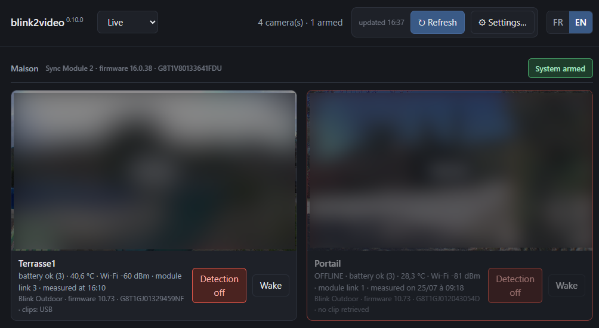
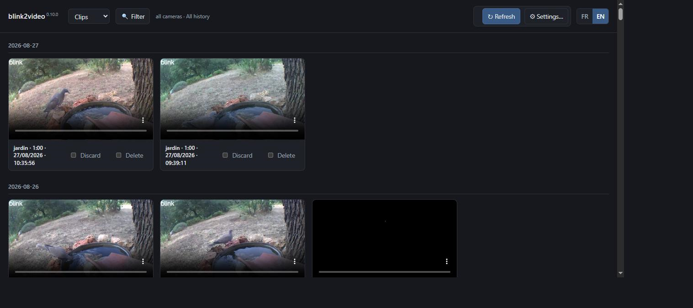
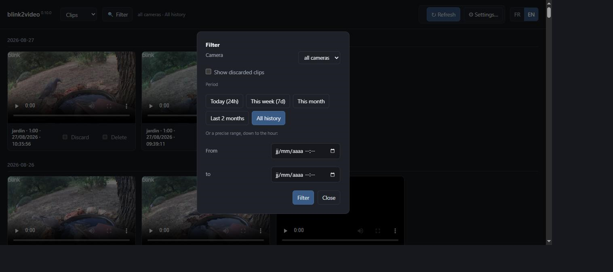
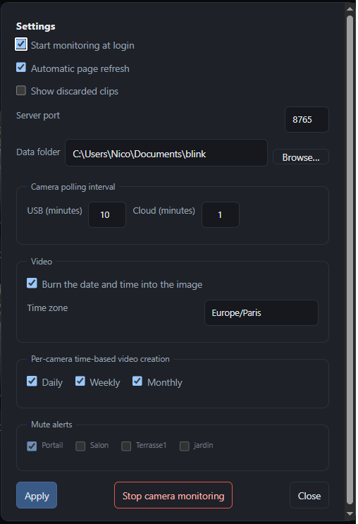

***English** | [Français](README.fr.md)*

# blink2video

**Manage your Blink cameras from a computer, and keep what they record.**

Blink is built for the phone: one clip at a time, no archive, no desktop
counterpart. Recordings live on a USB stick in a Sync Module 2 or a microSD card
in a Sync Module XR, erased as it fills up, or in the subscription cloud, which
keeps them for a few weeks.

blink2video is the missing side. A local interface to watch cameras live and arm
detection. And what the phone cannot do at all: fetch clips before rotation
erases them, burn the time into the picture,
and assemble them into one video per day, per week and per month.

Everything runs on your machine. Nothing is sent anywhere.

The web interface listens on `127.0.0.1` only: nothing else on your local
network can reach it, just this machine. It has no login of its own beyond
the Blink account session, so anyone with access to this machine can open it.

## Features

- Live view of any camera in the browser, arming the system or a single camera.
- Live view recording on demand, one click while watching: saved to its own
  archive, browsable and filterable exactly like detection clips (discard,
  delete, camera and period filter).
- Incremental download of motion-detection clips from the module's local storage
  (Sync Module 2 USB stick or Sync Module XR microSD card)
  and from the subscription cloud, never fetching the same recording twice.
- Camera state at a glance: battery, temperature, signal, model and firmware
  for each camera.
- Date and time burned into the picture, so any player keeps it.
- One video per day, per ISO week and per month, for each camera.
- Uninteresting clips discarded in one click, moved aside rather than deleted,
  and never downloaded again.
- Continuous monitoring and alerts: camera offline, low battery, detection
  switched off, or nothing recorded for two days. Alerts to acknowledge,
  per-camera muting.
- Standalone bundle for Windows, Linux and macOS, ffmpeg included.

## Screenshots



Live view: one tile per camera, its latest thumbnail, arming for the system and
for each camera, battery, temperature, signal and the time of the reading. An
offline camera keeps reporting its last known values, and the interface says how
old they are. A Record button on each tile saves what's currently playing to
its own archive (`Blink_Direct`), browsable afterwards like detection clips.



Clips newest first. Each card gives the camera, the duration, the date and
the model, and the "Écarter" button removes the clip from every assembled
video.



One Filter button covers camera and time period together: quick presets
(today, this week, this month, last 2 months, or full history) or a precise
custom range down to the hour, to find a specific incident without endless
scrolling through an always-armed camera's history. The active filter stays
remembered between visits.



Settings, behind the gear icon: automatic startup with the session, automatic
page refresh, server port, data folder with a native folder picker, and local
storage and cloud polling cadence. Also timestamp burned into the picture,
time zone, daily/weekly/monthly archiving toggled independently per period,
per-camera alert muting, and a button to stop the whole thing without
touching the command line.

## Getting started

**1. Install.** Download the archive for your system from the
[latest release](https://github.com/nico579/blink2video/releases/latest) and
unpack it. ffmpeg travels inside the bundle; nothing is installed system-wide.

| System | Archive | First run |
|---|---|---|
| Windows 10/11, x86-64 | `blink2video-windows-x86_64.zip` | `blink2video.exe` from a terminal |
| Linux x86-64, glibc 2.35+ (Ubuntu 22.04+, Debian 12+) | `blink2video-linux-x86_64.tar.gz` | `chmod +x blink2video`, then `./blink2video` |
| macOS 12+, Apple Silicon | `blink2video-macos-arm64.zip` | `xattr -dr com.apple.quarantine blink2video`, then `./blink2video` |

Windows 7 SP1 x64 has a [separate experimental build](WINDOWS7.en.md). Its
[experimental.3 prerelease](https://github.com/nico579/blink2video/releases/tag/v0.9.16-win7-experimental.3)
has been validated on a real installation.

**2. Run it.** Double-click the executable (or `./blink2video` from a terminal).
No arguments needed: with no valid session yet, a browser tab opens by itself on
a sign-in page — your address, your password, then the code Blink sends. Only a
session token is kept, never the password. On the very first run, the Settings
panel then opens automatically. Check the data folder and time zone in
particular, then click “Apply”: no clip is downloaded before that confirmation.
Monitoring, clip downloading and video assembly then start at their own pace,
and clips appear as they come in. This first-run flow is not repeated when the
data folder is changed.

If the tab didn't open, or you closed it, `blink2video open` brings it back.

A tray icon also appears when `start` runs (Windows/macOS; Linux depends on
your desktop's tray support), with Open/Restart/Stop, no terminal needed.

**3. Settings.** The gear icon, top right, opens a panel: start automatically
when you log in, refresh the page on its own as clips arrive, how often local
storage and cloud are checked, and a button to stop everything. `blink2video autostart on`
and `blink2video stop` do the same from a terminal, if you'd rather.

<details>
<summary>From source, with Python 3.11 or newer</summary>

```bash
git clone https://github.com/nico579/blink2video
cd blink2video
python blink2video.py login
```

The first run creates an isolated environment in `~/.blink2video/venv` and
restarts there. `blink2video smoketest` then checks that everything works on your
machine.

The published binary is neither signed nor notarized: on macOS, Gatekeeper
refuses the first run of an archive downloaded through a browser, hence the
`xattr` in the table. Right-click then "Open" does the same. If you see
"Apple could not verify [...] is free of malware", that's this check, not an
actual malware detection: it just means no $99/year Apple developer account
signed the binary.

</details>

<details>
<summary>With Docker</summary>

```bash
git clone https://github.com/nico579/blink2video
cd blink2video
docker compose up -d
```

Or, without cloning, using the image published on
[Docker Hub](https://hub.docker.com/r/nico579dock/blink2video):

```bash
docker run -d --name blink2video --restart unless-stopped \
  -p 127.0.0.1:8765:8765 -e BLINK_TRUSTED_LOOPBACK_PROXY=1 \
  -v blink_data:/data nico579dock/blink2video
```

Open `http://127.0.0.1:8765` and sign in the same way. Settings, the session
and clips persist in a named volume (`blink_data`), separate from the image,
so rebuilding the image never loses anything.

The bundled `docker-compose.yml` publishes the port to `127.0.0.1` only,
matching the binary's own default: there is no login on the dashboard itself,
so nothing beyond this machine can reach it unless you deliberately widen the
port mapping yourself.

</details>

## The interface

The page, at `127.0.0.1:8765`, has five views:

- **Live**: one tile per camera, its state, detection arming, a fullscreen
  button, and a "Wake" button that requests a fresh photo from the camera
  right now instead of waiting for its next scheduled check-in (uses a bit
  of battery, can take up to two minutes on a sleeping camera).
- **Clips**: newest first, with a preview and an "Écarter" button that removes a
  clip from every assembled video.
- **Daily, Weekly, Monthly**: the assembled videos.

The Refresh button fetches new clips and rebuilds the videos, showing progress.

## Being warned

A camera going offline, a fading battery, detection switched off or a camera
silent for two days opens a dialog you must acknowledge. Alerts fire on change
only, so a camera you knowingly leave offline warns you once.

## Updating

When a newer release exists, the interface shows an **Install 0.x.y** button.
It does everything: download, stop, replace, start again, with whatever verbs
were running. Nothing is replaced until the new version has started and stated
its own version number, and the previous files are kept aside until the swap
succeeds.

## Where files go

```
Blink_Clips/       raw clips, as the module recorded them
Blink_Normalized/  the same with the time burned in
Blink_Excluded/    discarded clips, kept rather than deleted
Blink_Daily/       one video per camera per day
Blink_Weekly/      one per ISO week
Blink_Monthly/     one per month
Blink_Direct/      live view recordings, saved on demand
```

Next to the executable, or in the folder named by `BLINK_HOME`.

<details>
<summary>How it works</summary>

The normalized clip is the pivot. Each clip is re-encoded once, with the time
written into the picture, then kept for good. The daily, weekly and monthly
videos are only stream copies of those segments: no re-encoding, no generation
loss, a few seconds each.

That is what makes adding a clip cheap. A new arrival re-encodes only itself, at
roughly real time: a one minute clip costs about one minute, once.

The time is burned into the picture rather than added as a subtitle track, which
phones and messaging apps ignore. Time zone conversion happens on the Python
side, with ffmpeg running under `TZ=UTC0`: the chain depends on no system time
zone database.

A clip is identified by its camera and its recording instant, never by the
module's own identifier: restarting it renumbers everything, and clips already
downloaded would come back as new.

</details>

## Limits

- A camera out of range of the module accepts the live request but never sends a
  picture; the interface says so.
- On Linux, the imageio-ffmpeg binary is built without libfreetype and cannot
  burn the timestamp: `sudo apt install ffmpeg`. The tool tries every ffmpeg it
  finds and keeps the first that can write text. Windows and macOS need nothing.
- Notifications borrow each system's own tools: the native dialog on Windows,
  osascript on macOS, notify-send and zenity on Linux. Failing that, the watcher
  writes to `watch.log` and carries on. On Windows, the tool declares its
  notification identity on first use, in
  `HKCU\SOFTWARE\Classes\AppUserModelId\blink2video`: without it, the system
  drops notifications silently. Deleting that key undoes the declaration.
- Nothing runs while the computer is off: a camera failing at night is reported
  at the next logon.
- Blink refuses some API endpoints depending on the client version announced,
  with an "An app update is required" message. Live view and downloading work
  today; nothing guarantees Blink will not widen that refusal.
- Blink exposes no way to restart a stuck Sync Module: you have to unplug it.

## Neighbours

Other projects touch the same hardware, and complement each other more than they
compete:

- [blinkpy](https://github.com/fronzbot/blinkpy) is the API library everything
  else builds on, including this.
- [BlinkCamWindowsDashboard](https://github.com/mikeoverbay/BlinkCamWindowsDashboard)
  offers a web dashboard and clip downloading, from the cloud only, so a
  subscription is required, and without live view.
- [blinkbridge](https://github.com/roger-/blinkbridge) exposes a camera over
  RTSP, to plug into an existing surveillance system.
- [blink-live-view](https://github.com/andreiele/blink-live-view) focuses on
  desktop live view.

blink2video differs on three points: it reads **both** sources, the module's local
storage and the subscription cloud, never fetching the same recording twice; it
burns the time into the picture and assembles one video per day, per week and
per month; and it runs on all three systems as a standalone bundle, ffmpeg
included.

## Command line

Everything above already works from the page. This chapter is for the terminal
alternative: scripting, a headless machine, a custom composition, or the full
list of options.

<details>
<summary>All options</summary>

<!-- verbes:début -->
One command, one verb per action. `blink2video <verb> --help` gives each one's options.

```bash
blink2video login       # sign in to the Blink account, two-step verification handled
blink2video list        # what the Sync Module currently holds
blink2video download    # fetch new clips before rotation erases them
blink2video merge       # normalize, stamp and assemble day, week and month
blink2video watch       # check the installation and alert when it degrades
blink2video serve       # serve the web interface, to watch, discard, see live
blink2video start       # start everything with the recommended settings
blink2video open        # open the web interface in the browser
blink2video stop        # stop the instance running in the background
blink2video restart     # stop then relaunch with the current settings
blink2video update      # install the latest published release
blink2video autostart   # register the command that follows with your session
blink2video smoketest   # check that the installation works on this machine
```
<!-- verbes:fin -->

Options follow the verb: `blink2video serve --port 8899`. Several verbs can be
named in a row, each with its own options. What finishes runs in sequence, what
does not finish runs alongside: `blink2video download merge` downloads **then**
assembles, while `serve`, or any verb given `--loop`, holds its own process until
`blink2video stop`.

`blink2video <verb> --help` is always authoritative; this table summarizes.

**Root**: `login`, `list`, `download`. With no verb, the help is shown.

| Option | Effect |
|---|---|
| `--hub NAME` | Sync Module to use; all modules when omitted |
| `--camera NAME` | keep only this camera |
| `--since DAYS` | keep only clips from the last N days |
| `--output FOLDER` | destination of raw clips (default `Blink_Clips`) |
| `--overwrite` | replace existing files of a different size |
| `--from usb\|cloud\|all` | where to look for clips: local storage (USB or microSD), the subscription cloud, or both (default); `usb` is retained as the historical CLI name |
| `--loop [MINUTES]` | repeat instead of acting once (default 10) |

**`blink2video merge`**: normalization and assembly.

| Option | Effect |
|---|---|
| `--exclude CLIP…` | discard clips: the raw file moves to `Blink_Excluded`, the segment is deleted, the clip is never downloaded again |
| `--include CLIP…` | undo a discard: the raw file comes back and the clip is re-normalized |
| `--date YYYY-MM-DD` | limit to one day |
| `--camera NAME` | limit to one camera |
| `--force` | rebuild everything even if nothing changed |
| `--no-weekly` | do not rebuild the weekly aggregates |
| `--no-monthly` | do not rebuild the monthly aggregates |
| `--no-timestamp` | do not burn the date and time into the image |
| `--preset NAME` | libx264 preset, from `ultrafast` to `veryslow` (default `veryfast`) |
| `--crf N` | quality, 0 to 51, lower is better (default 21) |
| `--font FILE` | .ttf font for the timestamp |
| `--timezone ZONE` | time zone of the timestamp (default `Europe/Paris`) |
| `--input`, `--output`, `--normalized-output`, `--excluded-output`, `--weekly-output`, `--monthly-output` | location of each folder |

**`blink2video watch`**: check the state, alert when it degrades. `--ignore
CAMERA…` mutes a camera, then carries on checking; `--unignore CAMERA…` undoes
it.

| Option | Effect |
|---|---|
| `--loop [MINUTES]` | repeat instead of acting once (default 10) |
| `--ignore CAMERA…` | mute a camera, then carry on checking |
| `--unignore CAMERA…` | unmute |
| `--test` | fire a verification notification |
| `--dry-run` | show without notifying or saving state |

**`blink2video start`**: the recommended setup in one command. It is exactly
equivalent to:

```bash
blink2video serve  watch --loop 10  download --from all --usb-loop 10 --cloud-loop 1  merge --loop 5
```

Options given after `start` go to the interface, `--port` for instance.

**`blink2video serve`**: serve the web interface.

| Option | Effect |
|---|---|
| `--port N` | listening port (default 8765) |
| `--open-browser` | open the page in the browser on startup |
| `--hub NAME` | Sync Module; all modules when omitted |
| `--thumbs FOLDER` | thumbnail cache, disposable |
| `--timezone ZONE` | display time zone |
| the same folder options as `merge` | |

**`blink2video open`**: open the interface in the browser, and say so when
nobody is listening. `--port` if you moved it.

**`blink2video stop`**: stop the running instance and all its verbs. No options.

**`blink2video autostart`**: what will start when you log in.

| Command | Effect |
|---|---|
| `autostart on` | register `blink2video start` |
| `autostart on <verbs…>` | register that command instead of the default |
| `autostart status` | what is registered, and what is running |
| `autostart off` | remove the entry |

`--dry-run` shows without changing anything.

**`blink2video smoketest`**: installation check. `--keep` keeps the working folder,
`--timezone` picks the time zone of the demonstration video.

**Environment variables**

| Variable | Effect |
|---|---|
| `BLINK_HOME` | data folder, defaulting to the executable's own |
| `BLINK_BOOTSTRAP` | `auto`, `pip` or `none`: how the Python environment is handled |
| `BLINK_BIND` | internal address used by `serve`, defaulting to `127.0.0.1`. The UI deliberately remains local-only unless you opt in: set `0.0.0.0` to reach it from other machines on the LAN, or to bind it inside the official Docker container behind a `127.0.0.1` port publication. There is no authentication on the web UI, so only do this on a trusted home network, never expose it to the internet |

</details>

**First run**, one step at a time instead of the double-click:

```bash
blink2video login       # sign in, once
blink2video list         # check that it answers: clips held by the module
blink2video start        # same composition the double-click starts
```

**Grammar.** Three rules cover it. The verb first, its options after. Several
verbs can be named in a row, each with its own. What loops runs alongside, the
rest runs in sequence, in the order written. An option placed before the first
verb belongs to nobody, and is refused: `blink2video --loop 5 merge` will say so
rather than do something unexpected.

Everyday gestures:

```bash
blink2video start                  # everything, with the recommended settings
blink2video open                   # open the interface in the browser
blink2video stop                   # stop the background instance and its verbs
```

A single pass, leaving nothing running:

```bash
blink2video download               # both sources, once
blink2video download --from cloud  # one source only
blink2video download merge         # download, then assemble
blink2video download --since 7 merge   # catch up a week, then assemble
```

Redo one day, or discard a clip:

```bash
blink2video merge --camera jardin --date 2026-08-12
blink2video merge --exclude Blink_Clips/jardin/2026-08/2026-08-12_09-23-21Z_jardin.mp4
```

Compose your own, when the default does not fit:

```bash
blink2video serve --port 8899                       # the interface elsewhere
blink2video serve merge --loop 30                   # interface, and assembly every 30 min
blink2video watch --loop 5 download --from cloud --loop 1   # two loops, two paces
```

**Autostart.** The Settings checkbox does this for the recommended composition;
from a terminal:

```bash
blink2video autostart on                    # registers « blink2video start »
blink2video autostart status                # what is installed
blink2video autostart off                   # remove
blink2video autostart on watch --loop 30    # register the alerts only, instead
```

`autostart` runs nothing: it registers the command that follows it, exactly as
you would have typed it without the prefix. No administrator rights are needed,
and `--dry-run` shows what would happen.

<details>
<summary>Doing it yourself, without <code>autostart</code></summary>

**Windows**, a shortcut in the Startup folder:

```powershell
$s = (New-Object -ComObject WScript.Shell).CreateShortcut(
  "$([Environment]::GetFolderPath('Startup'))\blink2video.lnk")
$s.TargetPath = "C:\path\to\blink2video.exe"; $s.Arguments = "blink2video start"
$s.WorkingDirectory = "C:\path\to"; $s.Save()
```

Task Scheduler would also do, but its root folder requires elevation.

**macOS**, a launch agent in
`~/Library/LaunchAgents/com.nico579.blink2video.plist`:

```xml
<plist version="1.0"><dict>
  <key>Label</key><string>com.nico579.blink2video</string>
  <key>ProgramArguments</key>
  <array><string>/path/to/blink2video</string><string>serve</string><string>all</string><string>--loop</string><string>10</string><string>download</string><string>--from</string><string>cloud</string><string>--loop</string><string>1</string></array>
  <key>WorkingDirectory</key><string>/path/to</string>
  <key>RunAtLoad</key><true/>
  <key>KeepAlive</key><true/>
</dict></plist>
```

Loaded with `launchctl load`, stopped with `launchctl unload`.

**Linux**, a systemd user service in
`~/.config/systemd/user/blink2video.service`:

```ini
[Service]
ExecStart=/path/to/blink2video blink2video start
WorkingDirectory=/path/to
Restart=on-failure

[Install]
WantedBy=default.target
```

Enabled with `systemctl --user enable --now blink2video`, followed with
`journalctl --user -u blink2video -f`.

One launcher at a time: two give two watchers, and every notification twice.

</details>

**Updating.** The same thing the interface's button does:

```bash
blink2video update               # install the latest published release
blink2video update --check       # only say whether one exists
```

From a git clone, `update` runs `git pull` instead of downloading an archive.

To do it by hand, stop the instance first: it holds the interface port and
talks to the Sync Module.

```bash
blink2video stop                 # stops the instance and all its verbs
```

Then replace the folder with the new archive and start it again: the Startup
shortcut on Windows, `launchctl load` on macOS, `systemctl --user start
blink2video` on Linux. The next logon does it anyway.

`blink2video autostart status` says what is installed and whether an instance is
running. In a terminal, Ctrl+C is enough: `stop` exists for instances without a
console, which Ctrl+C cannot reach and whose verbs were left orphaned when only
the parent process was killed.

## Building

```bash
python build.py
```

Produces `dist/blink2video/`, about 110 MB, most of it ffmpeg. PyInstaller is not a
cross-compiler and the ffmpeg binary is platform-specific: each system needs its
own build. The release workflow handles that on GitHub runners.

## Code signing policy

The Windows executable is code-signed via [SignPath Foundation](https://signpath.org/),
free for open-source projects. Only the maintainer ([@nico579](https://github.com/nico579))
has commit access and controls the signing workflow, with two-factor
authentication required on that account. Signing is triggered from the public
release workflow ([release.yml](.github/workflows/release.yml)) against the
source tagged in this repository: no binary is signed outside that pipeline.

## Project status and responsible use

An independent project, used daily on Windows 10 against a real installation:
one module, four cameras, live view, arming and the archive. The Linux and macOS
executables are built and their video chain verified automatically, but they have
never run against real Blink hardware. Reproducible reports are welcome in the
issues.

Film responsibly. In France, the CNIL accepts watching your own home, but not
the public street nor a neighbour's doorway. This tool only keeps what your
cameras already record, but it makes the question more concrete by building a
lasting archive where the mobile app kept a few days.

That archive is personal data: images of your home, the presence patterns they
reveal, and a session file that grants access to your Amazon account. It all
stays on your machine, and the repository's `.gitignore` excludes those files.

## Licence, author and credits

Distributed under the GNU General Public License v3.0; see [LICENSE](LICENSE).
Consistency demands it too: the Linux bundle embeds a GPL build of ffmpeg, the
only one with libfreetype.

Designed and architected by Nicolas Martin ([@nico579](https://github.com/nico579)).
Code developed with the assistance of Claude (Anthropic) as a development tool.

[blinkpy](https://github.com/fronzbot/blinkpy) provides access to the Blink API,
including the `immis` protocol without which live view would be out of reach, and
[ffmpeg](https://ffmpeg.org/) does all the video work. The notes in
[BlinkMonitorProtocol](https://github.com/MattTW/BlinkMonitorProtocol) helped to
understand what the API offers, and above all what it does not.

Not affiliated with Blink or Amazon. Blink is an Amazon trademark.
